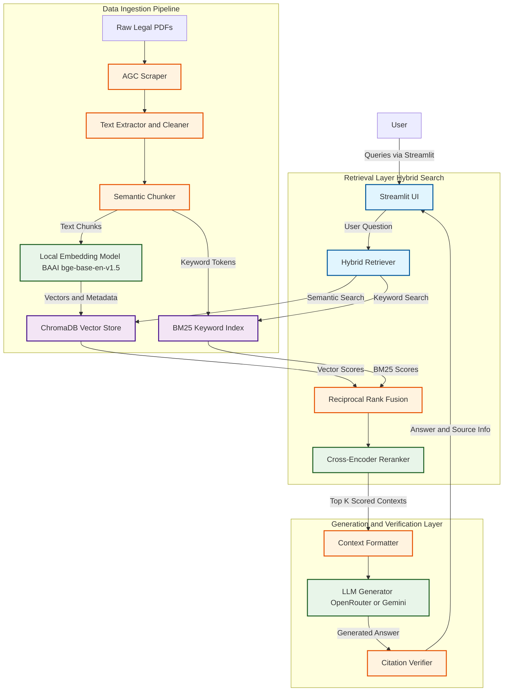

# Malaysian Legal RAG - System Architecture

## Overview

The **MyLaw-RAG** project is a Retrieval-Augmented Generation (RAG) system specialized for querying Malaysian statutory law. It combines a robust data ingestion pipeline, a hybrid retrieval strategy with dynamic weighting and optional reranking, and an LLM-based generation layer that includes citation verification.

## 1. Data Ingestion Pipeline
The ingestion process transforms raw PDFs of legal Acts into a structured vector database and keyword index.

* **Stage 1: PDF Scraper (`agc_scraper.py`)** -> Downloads official PDFs from the Attorney General's Chambers (AGC).
* **Stage 2: Text Extractor (`text_extractor.py`)** -> Cleans text (removes headers, footers, watermarks).
* **Stage 3: Semantic Chunker (`chunker.py`)** -> Splits text by legal sections (e.g., "Section 1", "PART I") rather than arbitrary token boundaries. Extracts metadata: act name, section number, subsection, keywords, cross-references. Repeats section titles in the content to boost BM25 retrieval for specific sections.
* **Stage 4: Vector Ingestion (`vector_ingest.py`)** -> Embeds chunks using the `BAAI/bge-base-en-v1.5` model (768-dim) via `sentence-transformers`. Prepends an identity header to improve encoding specificity. Upserts into a persistent ChromaDB collection.

## 2. Retrieval Layer (`hybrid_retriever.py`)
The system employs a sophisticated Hybrid Search, running both continuous (semantic) and sparse (keyword) queries.

* **Semantic Search**: Queries the ChromaDB index using cosine similarity.
* **Keyword Search**: Uses `BM25Okapi` with custom tokenization that preserves legal terms (e.g., "section_10"). A query expansion step optionally appends specific Act titles (like "Sale of Goods Act 1957") if indicative terms are present, helping ground the BM25 search.
* **Dynamic Weighting & Reciprocal Rank Fusion (RRF)**: Results are fused using RRF. The weights for Semantic/Keyword aren't static (50/50); they dynamically shift based on the prompt (e.g., explicit section queries get a 75% keyword bias).
* **Cross-Encoder Reranking**: Re-scores top N candidates using `cross-encoder/ms-marco-MiniLM-L-6-v2` for maximum precision before passing to the generator.

## 3. Generation & Verification Layer (`rag_chain.py`)
This layer handles the dialogue logic using LangChain.

* **Language Models**: Primary generation happens via OpenRouter interface using free-tier models (auto-routed) or via Google Gemini, driven by `ChatOpenAI` and `ChatGoogleGenerativeAI` classes.
* **Citation Grounding**: Formats context with structural mapping `[Source X: Act Name, Section Y - Title]`.
* **Citation Verifier (`citation_verifier.py`)**: Validates whether the LLM's references accurately exist within the provided retrieved context.
* **Response Logger (`response_logger.py`)**: Logs the entire interaction (query, model, results, times) for evaluation.

## 4. User Interface (`app.py`)
* **Streamlit Web App**: Provides a chat interface where users can query legal concepts and explore the source chunks that the generation was based on. Allows dynamic switching between various OpenRouter and Gemini models.

## Technology Stack Summary
* **Language & Frameworks**: Python 3.12+, LangChain, Streamlit
* **Databases**: ChromaDB (Vector Search), rank_bm25 (Keyword Search), PostgreSQL + pgvector (Alternative Database Layer)
* **Embedding Model**: `sentence-transformers` -> `BAAI/bge-base-en-v1.5`
* **Parsing Tools**: `pypdf`, `re`, `tiktoken`
